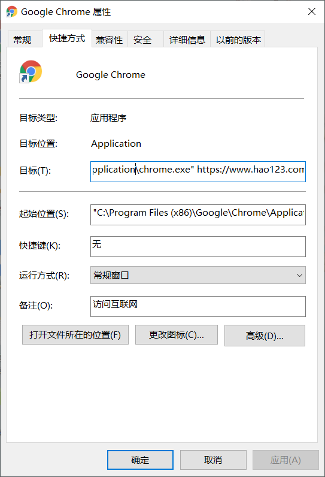
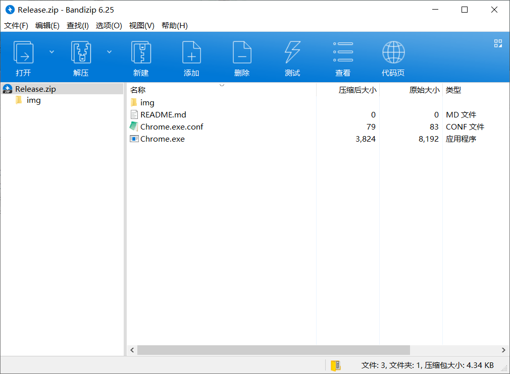
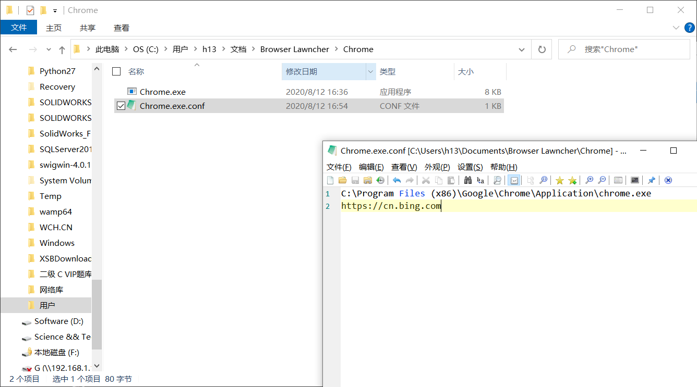
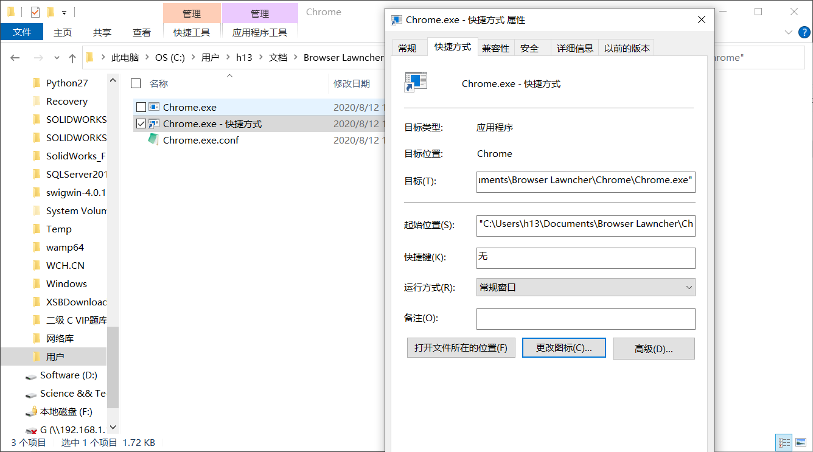
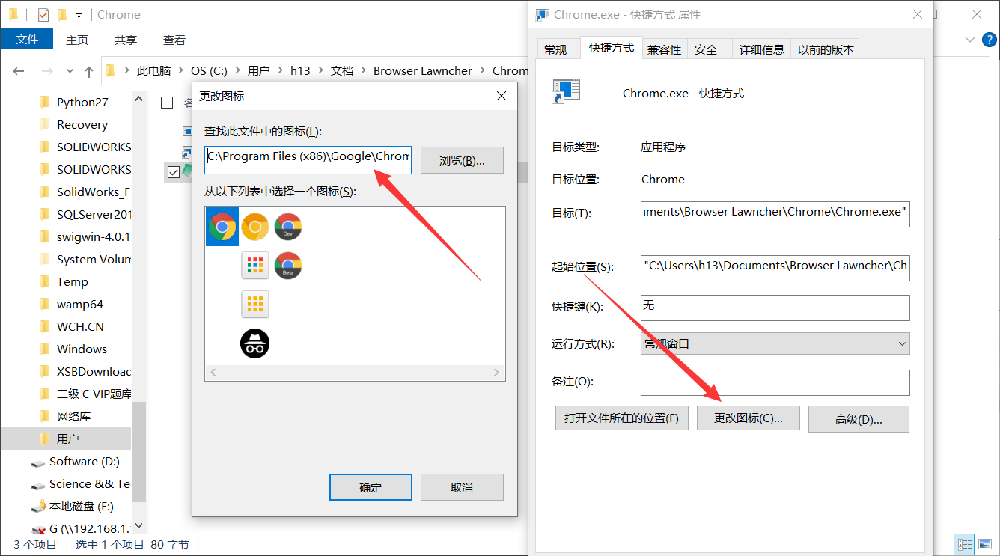
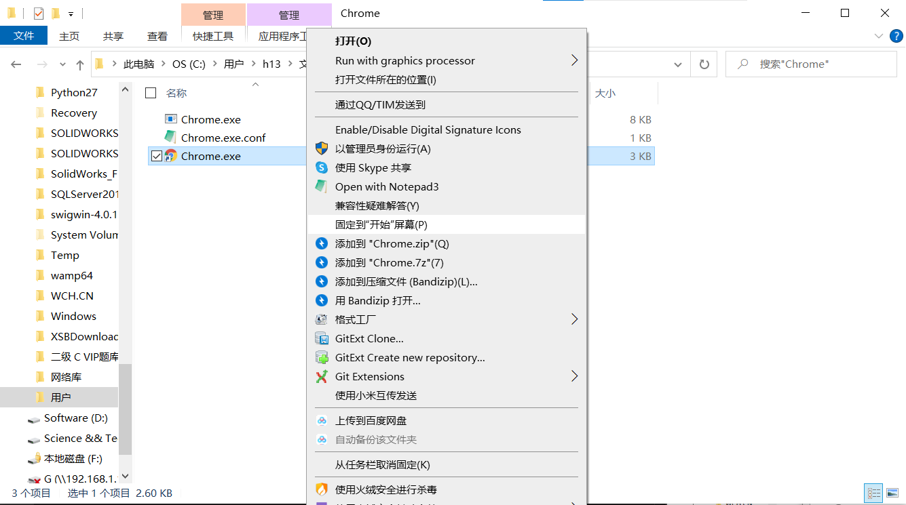
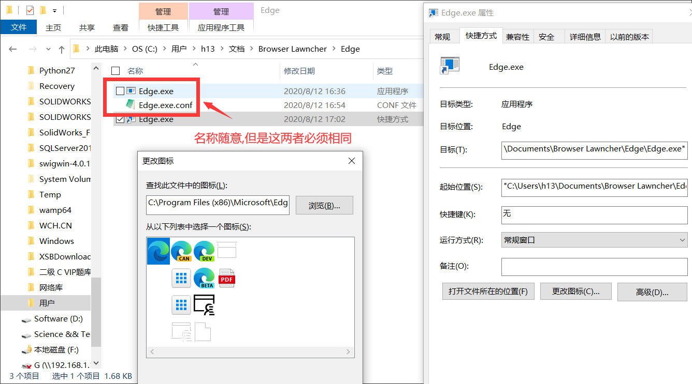

# Browser Lawncher
别名: 去他妈的主页劫持

## 用途: 
避免流氓软件通过修改快捷方式来劫持主页
eg: 


## 原理:
生成一个exe,调用cmd直接打开对应浏览器
即本exe等效于:
cmd下自动输入:
```
"C:\Program Files (x86)\Google\Chrome\Application\chrome.exe"
```

## 使用方法:
建议使用 `Browser Lawncher Lawncher` 来进行可视化设置 (禁止套娃)
https://github.com/h13-0/Browser-Lawncher-Lawncher
如果选择使用 `Browser Lawncher Lawncher` 来配置的话,配置过程会相当简单,下文中 `手动配置方法` 可以直接略过了,具体详见对应项目主页。

## 手动配置方法
### 配置文件Demo:
```
C:\Program Files (x86)\Google\Chrome\Application\chrome.exe
https://www.google.com
```
或者
```
C:\Program Files (x86)\Google\Chrome\Application\chrome.exe
```
**第一行是你浏览器的文件位置,第二行开始是参数,参数可以是自定义主页等等**

### exe配置文件工作方式
exe在启动时,会读取同目录文件夹下的同名的配置文件
比如exe储存在:
```
C:\Users\h13\Documents\Chrome\Chrome.exe
```
则其会读取:
```
C:\Users\h13\Documents\Chrome\Chrome.exe.conf
```

随后程序会检测第一行对应文件是否存在,如果存在则执行cmd命令,不存在则弹窗提示。

所以本程序虽然名称为 `Chrome.exe` 但是你可以拿它打开 `Edge` 等任何浏览器。Chrome.exe只是一个Demo.

### 手动使用方法:

解压Release后有如下文件


只需要提取
```
Chrome.exe
Chrome.exe.conf
```
这两个文件到一个任意一个没有权限的目录,这里我选择的是 `%USERPROFILE%\Documents\Browser Lawncher\Chrome` 即个人文档文件夹。

然后

按照需求填写配置文件

创建快捷方式


美化一下,借用Chrome的图片


随后无论是固定到开始菜单还是放到桌面还是干什么都很简单


### 举一反三
Edge也是如此。

解压到任意一个文件夹

修改配置文件
```
C:\Program Files (x86)\Microsoft\Edge\Application\msedge.exe
https://github.com/
```

创建快捷方式,借用图标

完事